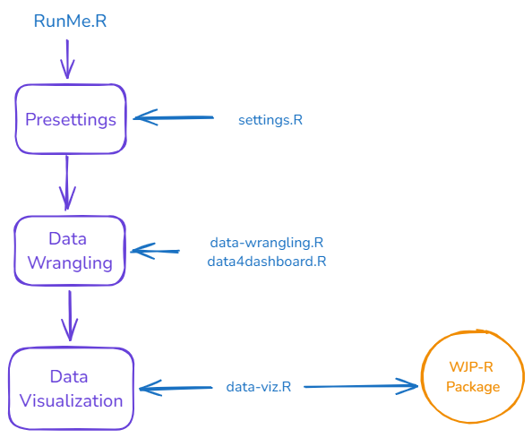
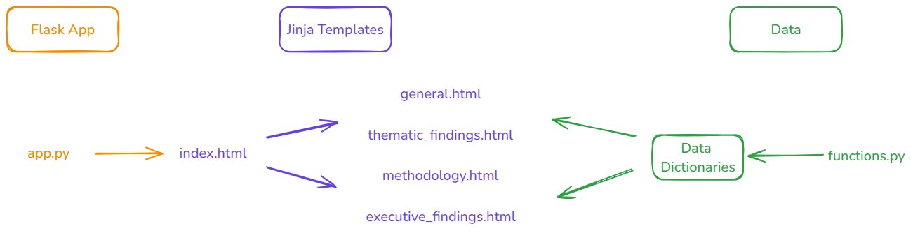

The **_Rule of Law in the United States 2024_** presents question-level data drawnfrom the General Population Poll (GPP), an original data source designed and collected by the World Justice Project. The GPPwas conducted through online interviews to a nationally representative sample of 1,046 U.S. households in 2024. This poll wasdesigned to capture data on the experiences and perceptions of ordinary people regarding a variety of themes related to the ruleof law.

The data derived from the General Population Poll is presented in this report as thematic briefs, each one highlighting a different dimension of the rule of law from the perspective of people in the United States. The sections of this report describe people's perceptions and attitudes towards the following topics: accountability, authoritarianism, corruption, and trust in institutions. This edition of the **_The Rule of Law in the United States: Key Findings from the WJP General Population Poll 2024_** also presents a new set of questions related to the 2024 Presidential elections. These new questions are focused on the integrity of the electoralprocess and on people's attitudes when presented with hypothetical scenarios.

This GitHub repository contains the integral code used to produce the report and all its data visualizations. In order to prepare these VIZs, the DAU followed the specifications sent by the communications and design team.

## Files description
The repository is divided into two major directories [`data-viz`](https://github.com/WJP-DAU/USA-report-2024/tree/main/data-viz) and [`html`](https://github.com/WJP-DAU/USA-report-2024/tree/main/html).

The `data-viz` directory contains all the routines to produce the data visualizations for the report. All data visualizations were produced using R as the main programming language and the [WJP-R Package](https://github.com/ctoruno/WJPr) developed by [ctoruno](https://github.com/ctoruno). The `data-viz` routine follows our usual modular programming style.

The data to be used in this project is a subset from the merged.dta file managed by the organization. Due to the privacy discloures followed by the DAU (see the [DAU R Coding Handbook](https://ctoruno.quarto.pub/wjp-r-handbook/)), the contents of the `Data` and `Outputs` directories are limited on the GitHub repository and their full content can only be accessed through the WJP SharePoint.

The VIZs are stored as vectors in SVG format.

The `html` directory contains all the code used to produce the HTML (web) version of the report. The report is produced using Python as the main programming language, more specifically, using a [Flask app](https://flask.palletsprojects.com/en/3.0.x/) and [Jinja2 templates](https://jinja.palletsprojects.com/en/3.1.x/). Basic Knowledge of HTML and CSS is required to understand how the app renders the report.

## Code logic
As mentioned above, the repo into two major directories [`data-viz`](https://github.com/WJP-DAU/USA-report-2024/tree/main/data-viz) and [`html`](https://github.com/WJP-DAU/USA-report-2024/tree/main/html). Each one of these processes follows their own code logic and they can be worked as independent modules frome ach other. However, the general instructions on how each one of these processes will work are contained in the `report_outline.xlsx` file. As a result, the `report_outline.xlsx` is **the most important** file in the repository. It contains five tabs:
1. `general_info`: This tab has information on general variables used to produced the web version of the report.
2. `outline`: This tab contains information on how the program will structure the report page by page. For example, here you can find information on to which section and sub-section each page belongs to, which figures are going to be assigned to that page, and what is the design or outline for that specific page.
3. `figure_map`: This tab contains information on how the program will produce each chart panel by panel. Here you can find the title, subtitle, source, and footnotes for each chart; the header for each panel, the variables used in each panel, how to group and aggregate the variables; the legend and color codes use in each panel; the years to cover in each visualization; and the type of chart to plot using the [WJP-R Package](https://github.com/ctoruno/WJPr) developed by [ctoruno](https://github.com/ctoruno).
4. `other_publications`: This tab contains information on the images and links used in the _Other Publications_ section of the report.
5. `methodological_materials`: This tab contains information on the links used in the _Methodological Materials_ section of the report.

The `data-viz` process follows a modular programming approach similar to our previous country reports. In summary, the routine can be run from top to bottom through the `RunMe.R` script. The routine is divided into three steps:

1. Presettings: In this step, we load the data, the fonts, a general aesthetic theme, and we reset the outputs folder.
2. Data Wrangling: The data wrangling is divided in two tasks. First, the RunMe creates a **Data Bank** that contains all the possible data points from the variables of interest. The instructions regarding how to group the question answers can be find in the `reports_outline.xlsx` file. This data bank produces data points for all possible years and for all the demographic groups considered, regardless if they will be used or not in the report. Once the data bank is functional, the RunMe proceeds to produce a `data_points` list which will be structured following the `figure_map` tab of the `report_outline.xlsx`. In a nutshell, the `data_points` list will specifically pick which data points each panel of each chart will be using and retrieving them from the data bank.
3. Data Visualization: Finally, the RunMe a `data_plots` list structured following the `figure_map` tab of the `report_outline.xlsx`. Basically, the program takes a look at what type of chart each panel is (line, slope, bars, radar, etc), and what is the overall layout or design of the page in which teh chart is going to be placed. Once it has this information, it passes it to a `callVisualizer` function that is in charge of calling the respective plotting function from the [WJP-R Package](https://github.com/ctoruno/WJPr), arranging the required parameters, and saving the chart following the respective dimensions for the page layout.

The `html` process is structured in a different way and innovative way. Instead of having a full HTML template to modify like in our previous reports, we now render the web version of the report by making us of a [Flask app](https://flask.palletsprojects.com/en/3.0.x/) and [Jinja2 templates](https://jinja.palletsprojects.com/en/3.1.x/).

The process starts with a Flask app contained in `app.py`, the flask app renders a master Jinja template called `index.html`. Inside the master template, there are other modular templates depending on the design and overall layout of the planned sections. These modular templates are organized in four files:
1. `general.html`: containing brief templates of sections and/or pages that are always used in our country reports. These templates are usually easy to replicate and most of them are only used once in every report.
2. `thematic_findings.html`: containing the templates for the thematic findings. These templates are usually used multiple times along the body of the report. The templates are programmed following how many panels is planned for each page: single, bipanel, tripanel, quadpanel, pentapanel, and hexpanel.
3. `methodology.hmtl`: containing the two templates for the methodology section.
4. `executive_findings.html`: containing one single template used for the executive findings.

The Jinja templates only contain the HTML code used for each `<section>` tag. Therefore, these templates need to be populated with information. The information for each `<section>` tag is produced using the python functions found in the `functions.py` script. These functions have the objective of producing two different data dictionaries: (i) `dynamic_data`, a dictionary containing the info that will populate the general, methodology, and executive findings templates; and (ii) `thematic_findings`, a dictionary containing the info that will populate the thematic findings templates.

## Contact
For inqueries please contact _Carlos Toruño_ (ctoruno@worldjusticeproject.org). For general information on the USA Report 2024, please contact _Ana María Montoya_ (amontoya@worldjusticeproject.org).